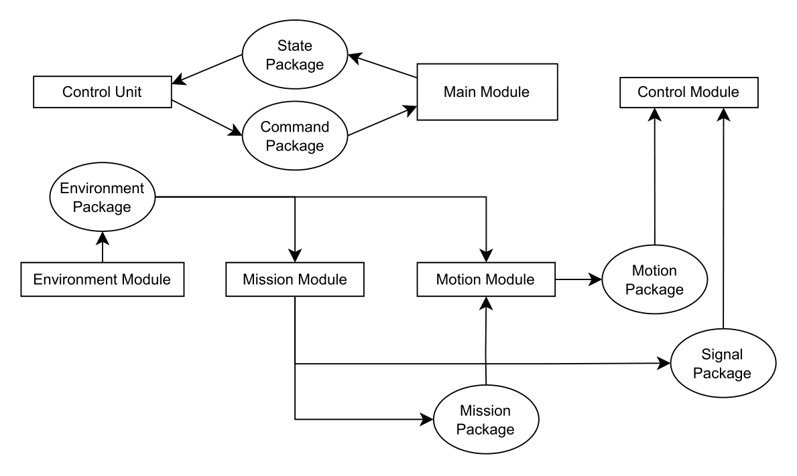

# Modular System Architecture – ControlSystem

This project implements a **fully modular, hot-swappable control system** for Autonomous Underwater Vehicles (AUVs). The architecture is designed for flexibility, rapid prototyping, and robust operation in complex environments.

  

---

## Core Systems
- **`main_system.h`**: Orchestrates system initialization and module coordination
- **`subsystem.h`**: Base template for all modules (enables standardized communication)
- **`communication_methods.h`**: Implements ZeroMQ-based pub/sub communication
- **`topics.hpp`**: Defines standardized message formats (ROS-like)

## Communication Architecture
- **ZeroMQ Implementation**:
  - TCP-based PUB/SUB pattern for inter-process communication
  - Protobuf-serialized messages for efficient data transfer
  - Configurable endpoints (e.g., `tcp://localhost:5555`)
- **Message Handling**: Fast and customizable structure via templated pub/sub methods

## Functional Modules
- **Control System (`control_system.h`)**
  - Interfaces with NLMPC controller (`nlmpc.h`)
  - Implements vehicle dynamics models (`vehicle_model.h`)
- **Environment System (`environment_system.h`)**
  - Updates vehicle state
- **Mission System (`mission_system.h`)**
  - Executes mission profiles (`mission.h`)
  - Supports specialized missions (e.g. `mission_sonar_imp.h`)
- **Motion System (`motion_system.h`)**
  - Integrates path planning with control outputs
  - Manages actuator interfaces
- **LLM Agent (`agent/llm_agent.py`)**
  - Processes user commands and sensor data
  - Generates high-level mission configurations using a Large Language Model (e.g., Hugging Face LLaMA)
  - Can be integrated as a hot-swappable module for autonomous decision making

---

## Modular Build & Hot-Swappable Modules

### Subsystem Design

- **Core abstraction:** All modules inherit from the [`Subsystem`](include/system/subsystem.h) base class.
- **Threaded execution:** Each subsystem runs in its own thread, with safe start/stop/halt operations.
- **Hot-swapping:** Modules can be initialized, started, stopped, or replaced at runtime without affecting other components.
- **Synchronization:** Internal mutexes and condition variables ensure thread safety and coordinated execution.

#### Example: Creating a New Module

To add a new module:
1. **Inherit from `Subsystem`:**
    ```cpp
    class MyCustomSystem : public Subsystem {
    public:
        MyCustomSystem(const std::string& name, int runtime, unsigned int system_code)
            : Subsystem(name, runtime, system_code) {}
        void halt() override { /* ... */ }
    private:
        void function() override { /* ... */ }
        void publish() override { /* ... */ }
    };
    ```
2. **Implement required methods:**  
   - `function()` – main work loop
   - `publish()` – communication logic
   - `halt()` – cleanup and shutdown

---

## Adding Modules to the System

Modules are registered and managed in [`main_system.cpp`](src/system/main_system.cpp):

- **Central orchestrator:** `MainSystem` holds a map of all subsystems.
- **Dynamic instantiation:** New modules are added via the constructor or configuration.
- **Example:**
    ```cpp
    systems_[SystemID::MY_CUSTOM] = std::make_unique<MyCustomSystem>("Custom", runtime, 5);
    ```
- **Lifecycle management:**  
  The main system can `init`, `start`, `stop`, or `halt` any module individually or collectively via command parsing.

---

## Modular Communication System

### Topics & Messaging

- **Topic-based messaging:** All communication uses strongly-typed topics defined in [`topics.hpp`](include/communication/topics.hpp).
- **ZeroMQ PUB/SUB:**  
  - Publishers and subscribers are templated for each topic type.
  - Adding a new topic is as simple as defining a struct and using the provided `Publisher<Topic>` or `Subscriber<Topic>` classes.
- **Serialization:**  
  - Topics are serialized/deserialized automatically for efficient transport.
- **Example:**
    ```cpp
    Publisher<EnvironmentTopic> env_pub;
    env_pub.bind("tcp://*:5555");
    env_pub.publish(env_topic_data);

    Subscriber<MotionTopic> motion_sub(motion_data, motion_mutex);
    motion_sub.connect("tcp://localhost:5556");
    ```

### Adding New Communication Channels

1. **Define a new topic struct in `topics.hpp`:**
    ```cpp
    struct MyTopic {
        double value;
        static constexpr const char* TOPIC = "MyTopic";
        // ...set/get methods...
    };
    ```
2. **Instantiate publisher/subscriber:**
    ```cpp
    Publisher<MyTopic> my_pub;
    Subscriber<MyTopic> my_sub(my_data, my_mutex);
    ```

---

## Extending the System

- **Add new modules:**  
  - Implement as a subclass of `Subsystem`.
  - Register in `MainSystem`.
- **Add new communication topics:**  
  - Define in `topics.hpp`.
  - Use templated publisher/subscriber classes.
- **Hot-swap modules:**  
  - Use system commands or direct API calls to start/stop/replace modules at runtime.